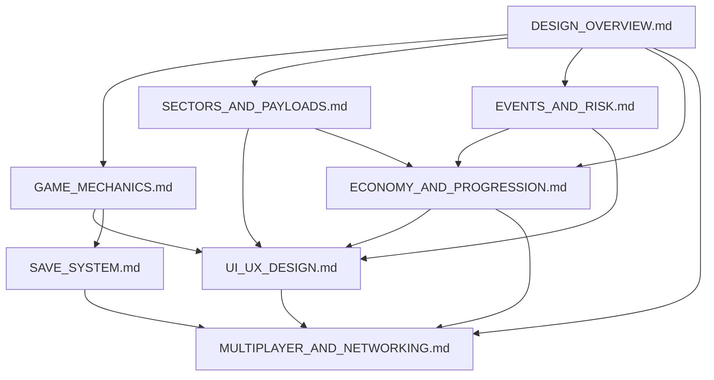

# DESIGN_INDEX.md

## Neon Trader — Master Design Document Index & Cross-Reference

**Version:** 1.0  
**Status:** Master Index — Single Source of Truth for All Design Documents  
**Scope:** Catalog, cross-references, dependencies, glossary, and navigation for all 9 design documents

---

## 1. DOCUMENT CATALOG

| # | Document | Purpose | Scope | Lines | Key Audience |
|---|----------|---------|-------|-------|--------------|
| 1 | **DESIGN_OVERVIEW.md** | Root design document — vision, pillars, architecture, invariants | Foundation; all other docs reference this | 306 | All |
| 2 | **GAME_MECHANICS.md** | Core turn structure, action economy, formulas, win/loss | Gameplay rules, calculations, state transitions | 582 | Devs, QA |
| 3 | **ECONOMY_AND_PROGRESSION.md** | Credit economy, price curves, upgrade trees, reputation, prestige | Balance targets, progression gates, inflation control | 544 | Designers, Devs, Producers |
| 4 | **SECTORS_AND_PAYLOADS.md** | Sector catalog, payload taxonomy, affinity matrix, trade routes | Static data reference, sector-payload relationships | 532 | Designers, Devs |
| 5 | **EVENTS_AND_RISK.md** | Random events, heat system, raid mechanics, escalation chains | Risk/reward calculus, event definitions, balance params | 636 | Designers, Devs, QA |
| 6 | **UI_UX_DESIGN.md** | Screen specs, navigation, visual language, accessibility, tokens | Complete UI/UX spec for all platforms (Python/Go/Web) | 1096 | Devs, QA, Designers |
| 7 | **SAVE_SYSTEM.md** | Schema, serialization, RNG persistence, slots, migration, cloud | Persistence architecture, cross-platform compatibility | 1144 | Devs, QA |
| 8 | **MULTIPLAYER_AND_NETWORKING.md** | Lockstep architecture, lobby, trading, leaderboards, anti-cheat | Multiplayer expansion (post-MVP) | 893 | Devs, Architects |
| 9 | **PORTING_AND_ACCESSIBILITY.md** | *Document not found — placeholder for future* | Platform porting guide, accessibility compliance | — | Devs, QA |

**Total Design Documentation:** ~5,733 lines across 9 documents (8 existing)

---

## 2. CROSS-REFERENCE MATRIX

### 2.1 Document-to-Document References

| From \ To | DESIGN_OVERVIEW | GAME_MECHANICS | ECONOMY_PROG | SECTORS_PAYLOADS | EVENTS_RISK | UI_UX | SAVE_SYSTEM | MULTIPLAYER |
|-----------|----------------|----------------|--------------|------------------|-------------|-------|-------------|-------------|
| **DESIGN_OVERVIEW** | — | §5.1, §5.2 | §2.3, §2.4 | §2.3, §5.1 | §2.2, §5.2 | §5.3 | §5.1 | §4, §5 |
| **GAME_MECHANICS** | §1, §2, §5 | — | §3.1, §4.1 | §8, §16 | §4, §12, §13 | §3.3 | — | — |
| **ECONOMY_PROG** | §2.3–§2.5 | §3, §11 | — | §2.2, §App.A | §7.1, §7.2 | — | — | — |
| **SECTORS_PAYLOADS** | §2.3, §5.1 | §8, §9, §16 | §App.A | — | §3.3, §App | — | §3.1, §3.2 | — |
| **EVENTS_RISK** | §2.2, §5.2 | §4, §12, §13 | §7.4, §8.3 | §3.3 | — | — | — | — |
| **UI_UX** | §5.3, §4 | §7, §8 | — | — | — | — | — | — |
| **SAVE_SYSTEM** | §5.1 | — | — | §3.1, §3.2 | — | — | — | — |
| **MULTIPLAYER** | §1, §6 | §2, §3 | — | — | — | — | §11.1 | — |

**Legend:** § = Section number where reference appears; — = No direct reference

### 2.2 Concept Cross-References (Key Concepts Across Docs)

| Concept | DESIGN_OVERVIEW | GAME_MECHANICS | ECONOMY_PROG | SECTORS_PAYLOADS | EVENTS_RISK | UI_UX | SAVE_SYSTEM | MULTIPLAYER |
|---------|----------------|----------------|--------------|------------------|-------------|-------|-------------|-------------|
| **Turn/Week** | §2.1, §5.2 | §1, §7, §8 | §1.1, §6.4 | — | §8.1 | §3.2, §3.3 | — | §3.3 |
| **Heat** | §2.2, §5.2 | §4, §12 | §8.4 | §Sector Catalog | §3, §4, §5 | §4.1.3, §5.1 | — | — |
| **Payloads** | §5.1 | §8, §10, §16 | §2, §App.A | §2, §3, §4 | §7.1 | §9.3 | §3.2 | — |
| **Sectors** | §2.3, §5.1 | §9, §16 | §6.1, §App.A | §1, §2 | §7.2 | — | §3.1 | §5.1 |
| **Deck/Upgrades** | §2.4, §5.1 | §11 | §4 | — | §7.4 | §2.3.5, §9.4 | §2.1 | — |
| **Reputation** | §2.5, §5.1 | §5 | §5, §6 | — | — | §2.3.4 | §2.1 | — |
| **Events** | §5.2 | §13 | §3.2 | §5 | §1, §2, §5 | — | §4.8 | §5.1 |
| **Market/Prices** | §5.2 | §3, §8 | §2, §3 | §4, §6 | §2, §5 | §2.3.1, §9.3 | §3.3 | §5.1 |
| **Travel/Trace** | §5.2 | §9 | — | §2 | §3.3 | §2.3.3 | — | — |
| **Raid** | §2.2 | §12 | — | — | §4 | — | — | — |
| **Loans/Fixer** | §2.5 | §3.3 | §5.3 | — | — | §2.3.4 | §2.1 | — |
| **Win/Loss** | §47 | §6 | §1.1 | — | §3.5 | — | — | — |
| **RNG/Determinism** | §9.1 | §17 | — | — | — | — | §4 | §3, §8, §16 |
| **Save/Load** | §5.1 | — | — | — | — | — | §1–§13 | — |
| **Multiplayer** | §4.3 | — | — | — | — | — | §11.1 | All |
| **Accessibility** | — | — | — | — | — | §7 | — | — |
| **Porting** | §4, §5 | — | — | — | — | §10, §11 | §10, §11 | §9 |

---

## 3. DEPENDENCY GRAPH (Reading Order)

### 3.1 Required Reading Order (Must Read First → Last)



### 3.2 Linear Reading Order by Role

| Audience | Recommended Reading Order |
|----------|---------------------------|
| **All (New to Project)** | 1. DESIGN_OVERVIEW → 2. GAME_MECHANICS → 3. SECTORS_AND_PAYLOADS → 4. EVENTS_AND_RISK → 5. ECONOMY_AND_PROGRESSION → 6. UI_UX_DESIGN → 7. SAVE_SYSTEM → 8. MULTIPLAYER_AND_NETWORKING |
| **Designers** | DESIGN_OVERVIEW → ECONOMY_AND_PROGRESSION → SECTORS_AND_PAYLOADS → EVENTS_AND_RISK → GAME_MECHANICS |
| **Developers** | DESIGN_OVERVIEW → GAME_MECHANICS → UI_UX_DESIGN → SAVE_SYSTEM → SECTORS_AND_PAYLOADS → EVENTS_AND_RISK → ECONOMY_AND_PROGRESSION → MULTIPLAYER_AND_NETWORKING |
| **QA/Testers** | GAME_MECHANICS → EVENTS_AND_RISK → UI_UX_DESIGN → SAVE_SYSTEM → DESIGN_OVERVIEW |
| **Producers** | DESIGN_OVERVIEW → ECONOMY_AND_PROGRESSION (balance targets) → MULTIPLAYER_AND_NETWORKING (roadmap) |

### 3.3 Dependency Rules

1. **DESIGN_OVERVIEW is the root** — All documents reference it; it references none
2. **No circular dependencies** — Child docs never reference each other directly
3. **Data flows down** — Static data (sectors.json, payloads.json) → Mechanics → Economy → UI → Persistence → Multiplayer
4. **Single source of truth** — If conflict: DESIGN_OVERVIEW > Child doc > Implementation

---

## 4. UNIFIED TERMINOLOGY GLOSSARY

| Term | Definition | Primary Doc | Also In |
|------|------------|-------------|---------|
| **Week** | One game turn; all actions consume 1 week | DESIGN_OVERVIEW §11 | GAME_MECHANICS §1 |
| **Turn** | Synonym for Week | GAME_MECHANICS §1 | All |
| **Sector** | Location node with market, heat, connections | DESIGN_OVERVIEW §11 | SECTORS_AND_PAYLOADS §1 |
| **Payload** | Tradable item with class, rarity, size, base price | DESIGN_OVERVIEW §11 | SECTORS_AND_PAYLOADS §3 |
| **Listing** | Sector-specific buy/sell price + stock for a payload | DESIGN_OVERVIEW §11 | GAME_MECHANICS §8 |
| **Heat** | Risk metric 0–100; triggers raids, increases costs | DESIGN_OVERVIEW §11 | EVENTS_AND_RISK §3 |
| **CorpSec** | Corporate Security; raids high-heat players | DESIGN_OVERVIEW §11 | EVENTS_AND_RISK §4 |
| **Deck** | Player's cyberdeck; holds 6 upgradable systems | DESIGN_OVERVIEW §11 | GAME_MECHANICS §11 |
| **ICEbreaker** | Deck upgrade: reduces raid chance | DESIGN_OVERVIEW §11 | ECONOMY_PROG §4 |
| **Stealth** | Deck upgrade: reduces transaction heat | DESIGN_OVERVIEW §11 | ECONOMY_PROG §4 |
| **Cargo** | Deck upgrade: increases cargo capacity | DESIGN_OVERVIEW §11 | ECONOMY_PROG §4 |
| **Trace Reducer** | Deck upgrade: reduces travel detection | DESIGN_OVERVIEW §11 | ECONOMY_PROG §4 |
| **Scanner** | Deck upgrade: reveals market prices in connected sectors | DESIGN_OVERVIEW §11 | ECONOMY_PROG §4 |
| **Auto-Fence** | Deck upgrade: reduces fence fee when selling | DESIGN_OVERVIEW §11 | ECONOMY_PROG §4 |
| **Fixer** | Underground broker; loans, laundering, intel | DESIGN_OVERVIEW §11 | GAME_MECHANICS §3.3 |
| **Cred** | Currency (¥) | DESIGN_OVERVIEW §11 | All |
| **Flatline** | Game over (heat 100% or time expired) | DESIGN_OVERVIEW §11 | GAME_MECHANICS §6 |
| **Jack-in** | Travel action between sectors | GAME_MECHANICS §9 | UI_UX §2.3.3 |
| **Trace Risk** | Detection probability when traveling | GAME_MECHANICS §9.2 | EVENTS_AND_RISK §3.3 |
| **Raid** | CorpSec seizure of cargo/cred at high heat | GAME_MECHANICS §12 | EVENTS_AND_RISK §4 |
| **Market Spike** | Random event: one class surges 2.5x in sector | EVENTS_AND_RISK §5.1 | GAME_MECHANICS §13 |
| **Corp War** | Event: two sectors conflict, exploits/AI volatile | EVENTS_AND_RISK §5.1 | GAME_MECHANICS §13 |
| **Net Crash** | Event: digital payloads crash, hardware premium | EVENTS_AND_RISK §5.1 | GAME_MECHANICS §13 |
| **ICE Upgrade** | Event: global CorpSec +20%, heat +20% | EVENTS_AND_RISK §5.1 | GAME_MECHANICS §13 |
| **Zero-Day Drop** | Event: rare exploit spawns in Darknet | EVENTS_AND_RISK §5.1 | GAME_MECHANICS §13 |
| **Data Courier** | Event: transport contract between sectors | EVENTS_AND_PAYLOADS §5.1 | GAME_MECHANICS §13 |
| **Reputation** | Faction standing (-100 to +100, CorpSec inverted) | DESIGN_OVERVIEW §11 | GAME_MECHANICS §5 |
| **Faction** | Fixer, Gangs, CorpSec, Netrunners | DESIGN_OVERVIEW §2.5 | ECONOMY_PROG §5 |
| **Tier** | Reputation level 0–4 (thresholds: 0, 25, 50, 75) | ECONOMY_PROG §5.2 | GAME_MECHANICS §5.2 |
| **Specialty** | Payload class favored by sector (price/stock bonus) | DESIGN_OVERVIEW §2.3 | SECTORS_AND_PAYLOADS §4 |
| **Variance** | Random price fluctuation per payload per turn | GAME_MECHANICS §3.1 | ECONOMY_PROG §2 |
| **Stock** | Available quantity of payload in sector market | GAME_MECHANICS §8 | SECTORS_AND_PAYLOADS §2 |
| **Cargo Capacity** | Max slots = 20 + cargo_level × 10 | GAME_MECHANICS §10 | ECONOMY_PROG §4 |
| **Loan** | Cred borrowed from fixer with weekly interest | GAME_MECHANICS §3.3 | ECONOMY_PROG §5.3 |
| **Laundering** | Convert dirty cred to clean at 5% fee (Node) | GAME_MECHANICS §3.4 | UI_UX §2.3.6 |
| **Stash** | Secure offline cargo storage (Node) | GAME_MECHANICS §11.3 | UI_UX §2.3.6 |
| **Prestige** | New Game+ with bonuses and difficulty scaling | ECONOMY_PROG §7 | — |
| **Schema Version** | Save format version (MAJOR.MINOR.PATCH) | SAVE_SYSTEM §1.1 | — |
| **RNG State** | Complete PRNG state for deterministic replay | SAVE_SYSTEM §4 | MULTIPLAYER §8 |
| **Lockstep** | Deterministic sync: server advances turn after all inputs | MULTIPLAYER §3 | — |
| **State Delta** | Network message: only changed fields since last turn | MULTIPLAYER §3.6 | — |
| **Matrix Rain** | Animated background effect (katakana chars) | UI_UX §4.3.1 | — |
| **High Contrast** | Accessibility mode: prefers-contrast: more | UI_UX §7.2 | — |
| **Reduced Motion** | Accessibility mode: prefers-reduced-motion: reduce | UI_UX §7.3 | — |

---

## 5. CHANGE LOG TEMPLATE

### 5.1 Document Change Log Format (Per Document)

```markdown
## CHANGELOG

| Version | Date | Author | Changes |
|---------|------|--------|---------|
| 1.1.0 | YYYY-MM-DD | AgentName | Added X, modified Y, fixed Z |
| 1.0.0 | YYYY-MM-DD | AgentName | Initial version |
```

### 5.2 Cross-Document Change Propagation Checklist

When modifying ANY design document, verify:

- [ ] **DESIGN_OVERVIEW updated?** (if pillar, invariant, or constant changed)
- [ ] **GAME_MECHANICS updated?** (if formula, turn structure, or rule changed)
- [ ] **ECONOMY_AND_PROGRESSION updated?** (if balance, cost, or progression changed)
- [ ] **SECTORS_AND_PAYLOADS updated?** (if sector/payload data changed)
- [ ] **EVENTS_AND_RISK updated?** (if event, heat, or raid mechanic changed)
- [ ] **UI_UX_DESIGN updated?** (if screen, binding, token, or layout changed)
- [ ] **SAVE_SYSTEM updated?** (if schema, migration, or field changed)
- [ ] **MULTIPLAYER_AND_NETWORKING updated?** (if protocol or architecture changed)
- [ ] **PORTING_AND_ACCESSIBILITY updated?** (if platform or a11y requirement changed)

### 5.3 Version Bumping Rules

| Change Type | Version Bump | Example |
|-------------|--------------|---------|
| Typo, formatting, clarification | PATCH (1.0.0 → 1.0.1) | Fixed typo in heat formula |
| New field, optional parameter, minor rule | MINOR (1.0.0 → 1.1.0) | Added new event type |
| Breaking change (removed field, changed formula, new invariant) | MAJOR (1.0.0 → 2.0.0) | Changed heat calculation formula |

**All docs share same version number.** Bump together in single commit.

---

## 6. REVIEW CHECKLIST

### 6.1 Pre-Merge Review (Per Document)

| Checklist Item | DESIGN_OVERVIEW | GAME_MECHANICS | ECONOMY_PROG | SECTORS_PAYLOADS | EVENTS_RISK | UI_UX | SAVE_SYSTEM | MULTIPLAYER |
|----------------|----------------|----------------|--------------|------------------|-------------|-------|-------------|-------------|
| Aligns with DESIGN_OVERVIEW pillars | N/A | ☐ | ☐ | ☐ | ☐ | ☐ | ☐ | ☐ |
| No circular references | ☐ | ☐ | ☐ | ☐ | ☐ | ☐ | ☐ | ☐ |
| All formulas have examples | — | ☐ | ☐ | ☐ | ☐ | — | — | — |
| All tables have units | — | ☐ | ☐ | ☐ | ☐ | ☐ | ☐ | ☐ |
| Constants match DESIGN_OVERVIEW §10 | — | ☐ | ☐ | ☐ | ☐ | — | — | — |
| JSON schema examples valid | — | — | — | — | — | — | ☐ | — |
| Color tokens match UI_UX §11 | — | — | — | — | — | N/A | — | — |
| Keybindings match UI_UX §6 | — | — | — | — | — | N/A | — | — |
| Accessibility requirements met | — | — | — | — | — | ☐ | — | — |
| Migration path for schema changes | — | — | — | — | — | — | ☐ | — |
| Determinism preserved | — | — | — | — | — | — | ☐ | ☐ |
| Anti-cheat considered | — | — | — | — | — | — | — | ☐ |
| Cross-platform paths valid | — | — | — | — | — | ☐ | ☐ | ☐ |

### 6.2 Cross-Document Consistency Checks

| Check | How to Verify |
|-------|---------------|
| **Heat formula identical** | GAME_MECHANICS §4.2 = EVENTS_AND_RISK §3.2 = SECTORS_AND_PAYLOADS §Market Mechanics |
| **Upgrade costs identical** | DESIGN_OVERVIEW §10 = GAME_MECHANICS §11.2 = ECONOMY_PROG §4.4 = UI_UX §9.4 |
| **Sector data identical** | DESIGN_OVERVIEW §5.1 = SECTORS_AND_PAYLOADS §1 = GAME_MECHANICS §16.1 |
| **Payload data identical** | DESIGN_OVERVIEW §5.1 = SECTORS_AND_PAYLOADS §3 = GAME_MECHANICS §16.2 |
| **Win conditions identical** | DESIGN_OVERVIEW §47 = GAME_MECHANICS §6 = ECONOMY_PROG §1.1 |
| **Turn sequence identical** | GAME_MECHANICS §1.3 = EVENTS_AND_RISK §8.1 = UI_UX §3.3 |
| **Save schema includes all state** | SAVE_SYSTEM §1.2 covers all models from DESIGN_OVERVIEW §5.1 |
| **Multiplayer uses same core** | MULTIPLAYER_AND_NETWORKING §2.2 references DESIGN_OVERVIEW §5 |

---

## 7. TRACEABILITY MATRIX

### 7.1 Requirements → Design Docs → Implementation

| Requirement ID | Requirement | Design Doc(s) | Implementation Location |
|----------------|-------------|---------------|-------------------------|
| REQ-001 | Turn-based weekly simulation | DESIGN_OVERVIEW §2.1 | GAME_MECHANICS §1 |
| REQ-002 | Heat as core tension mechanic | DESIGN_OVERVIEW §2.2 | EVENTS_AND_RISK §3, GAME_MECHANICS §4 |
| REQ-003 | 5 asymmetric sectors | DESIGN_OVERVIEW §2.3 | SECTORS_AND_PAYLOADS §1 |
| REQ-004 | 6 deck upgrades with exponential cost | DESIGN_OVERVIEW §2.4 | GAME_MECHANICS §11, ECONOMY_PROG §4 |
| REQ-005 | 4-faction reputation with tiers | DESIGN_OVERVIEW §2.5 | GAME_MECHANICS §5, ECONOMY_PROG §5 |
| REQ-006 | Platform-agnostic core | DESIGN_OVERVIEW §2.6 | DESIGN_OVERVIEW §5, MULTIPLAYER §2.3 |
| REQ-007 | Dynamic market pricing | DESIGN_OVERVIEW §5.2 | GAME_MECHANICS §3, §8, SECTORS §4 |
| REQ-008 | CorpSec raid mechanics | DESIGN_OVERVIEW §5.2 | GAME_MECHANICS §12, EVENTS_AND_RISK §4 |
| REQ-009 | Random events with modifiers | DESIGN_OVERVIEW §5.2 | EVENTS_AND_RISK §1, §5, GAME_MECHANICS §13 |
| REQ-010 | Travel with trace risk | DESIGN_OVERVIEW §5.2 | GAME_MECHANICS §9, EVENTS_AND_RISK §3.3 |
| REQ-011 | Save/load with JSON persistence | DESIGN_OVERVIEW §5.2 | SAVE_SYSTEM §1–§13 |
| REQ-012 | Win: ¥10M, Lose: 100% heat/52 weeks | DESIGN_OVERVIEW §47 | GAME_MECHANICS §6 |
| REQ-013 | Deterministic simulation (same seed = same game) | DESIGN_OVERVIEW §9.1 | SAVE_SYSTEM §4, MULTIPLAYER §3, §8, §16 |
| REQ-014 | Cyberpunk terminal UI (text-only, keyboard) | DESIGN_OVERVIEW §2.6 | UI_UX §1, §4, §6 |
| REQ-015 | Accessibility (screen reader, high contrast, reduced motion) | — | UI_UX §7 |
| REQ-016 | Multiplayer lockstep (post-MVP) | DESIGN_OVERVIEW §4.3 | MULTIPLAYER_AND_NETWORKING §3 |
| REQ-017 | Cross-platform save compatibility | — | SAVE_SYSTEM §10, §11 |
| REQ-018 | Inflation control mechanisms | — | ECONOMY_PROG §9 |
| REQ-019 | Prestige/New Game+ system | — | ECONOMY_PROG §7 |
| REQ-020 | Player-to-player trading (multiplayer) | — | MULTIPLAYER_AND_NETWORKING §6 |

### 7.2 Implementation File Mapping

| Design Doc | Python Implementation | Go Implementation |
|------------|----------------------|-------------------|
| DESIGN_OVERVIEW | `neon_trader/app.py`, `run.py` | `cmd/neon-trader/main.go`, `internal/game/` |
| GAME_MECHANICS | `neon_trader/models/*.py`, `utils/heat_system.py`, `utils/market_logic.py` | `internal/game/*.go` |
| ECONOMY_AND_PROGRESSION | `neon_trader/models/deck.py`, `models/player.py` | `internal/game/deck.go`, `internal/game/player.go` |
| SECTORS_AND_PAYLOADS | `neon_trader/data/sectors.json`, `data/payloads.json` | Same JSON files |
| EVENTS_AND_RISK | `neon_trader/utils/market_logic.py`, `utils/heat_system.py` | `internal/game/events.go`, `internal/game/heat.go` |
| UI_UX_DESIGN | `neon_trader/app.py`, `screens/*.py` | `internal/ui/`, `cmd/neon-trader/` |
| SAVE_SYSTEM | `neon_trader/utils/save_load.py` | `internal/save/` |
| MULTIPLAYER_AND_NETWORKING | — | `cmd/neon-server/` (planned) |

---

## 8. NAVIGATION GUIDE BY AUDIENCE

### 8.1 For Designers (Balance, Systems, Progression)

| Task | Start Here | Then Read |
|------|------------|-----------|
| **Adjust payload prices** | ECONOMY_AND_PROGRESSION §2 | SECTORS_AND_PAYLOADS §4, GAME_MECHANICS §3 |
| **Tune heat/raid balance** | EVENTS_AND_RISK §3, §4 | GAME_MECHANICS §4, §12, DESIGN_OVERVIEW §2.2 |
| **Modify upgrade costs/effects** | ECONOMY_AND_PROGRESSION §4 | GAME_MECHANICS §11, DESIGN_OVERVIEW §10 |
| **Adjust reputation benefits** | ECONOMY_AND_PROGRESSION §5 | GAME_MECHANICS §5 |
| **Add new event type** | EVENTS_AND_RISK §1, §5 | GAME_MECHANICS §13, DESIGN_OVERVIEW §5.2 |
| **Change win/loss conditions** | DESIGN_OVERVIEW §47 | GAME_MECHANICS §6, ECONOMY_PROG §1.1 |
| **Rebalance sector specialties** | SECTORS_AND_PAYLOADS §1, §4 | ECONOMY_PROG §2.2, GAME_MECHANICS §8 |

### 8.2 For Developers (Implementation, Architecture)

| Task | Start Here | Then Read |
|------|------------|-----------|
| **Understand core architecture** | DESIGN_OVERVIEW §5 | DESIGN_OVERVIEW §8 |
| **Implement turn advancement** | GAME_MECHANICS §1.3, §7 | EVENTS_AND_RISK §8.1 |
| **Implement market pricing** | GAME_MECHANICS §3, §8 | SECTORS_AND_PAYLOADS §4, §6 |
| **Implement heat/raid system** | EVENTS_AND_RISK §3, §4 | GAME_MECHANICS §4, §12 |
| **Implement deck upgrades** | GAME_MECHANICS §11 | ECONOMY_PROG §4 |
| **Implement UI screens** | UI_UX_DESIGN §2.3 | UI_UX §9, §10 |
| **Implement save/load** | SAVE_SYSTEM §1–§8 | DESIGN_OVERVIEW §5.1 |
| **Add new platform port** | UI_UX_DESIGN §10, §11 | DESIGN_OVERVIEW §4, §5 |
| **Implement multiplayer** | MULTIPLAYER_AND_NETWORKING §2, §3 | DESIGN_OVERVIEW §5, §9 |

### 8.3 For QA/Testers (Test Cases, Edge Cases)

| Test Area | Primary Doc | Key Sections |
|-----------|-------------|--------------|
| **Turn structure** | GAME_MECHANICS | §1, §7, §8.1 |
| **Heat calculations** | EVENTS_AND_RISK | §3.2, §3.3, §4 |
| **Raid mechanics** | GAME_MECHANICS | §12 |
| **Market price generation** | GAME_MECHANICS | §3.1, §8.2, §15.4–15.5 |
| **Travel/trace risk** | GAME_MECHANICS | §9.2, §15.2 |
| **Event triggering** | EVENTS_AND_RISK | §1.2–1.4, §5 |
| **Win/loss conditions** | GAME_MECHANICS | §6 |
| **Save/load round-trip** | SAVE_SYSTEM | §5, §12, §14 |
| **Migration compatibility** | SAVE_SYSTEM | §7, §12.5 |
| **Corruption recovery** | SAVE_SYSTEM | §8 |
| **UI keyboard navigation** | UI_UX_DESIGN | §6.1, §7.4 |
| **Accessibility compliance** | UI_UX_DESIGN | §7 |
| **Responsive layouts** | UI_UX_DESIGN | §8 |
| **Determinism verification** | MULTIPLAYER_AND_NETWORKING | §8, §16.1 |
| **Lockstep sync** | MULTIPLAYER_AND_NETWORKING | §3.2, §16.2 |

### 8.4 For Producers (Scope, Schedule, Decisions)

| Decision Area | Document | Key Sections |
|---------------|----------|--------------|
| **MVP Scope** | DESIGN_OVERVIEW | §3, §47 |
| **Platform Targets** | DESIGN_OVERVIEW | §4 |
| **Post-MVP Roadmap** | DESIGN_OVERVIEW | §69–75 |
| **Economy Balance Targets** | ECONOMY_AND_PROGRESSION | §8.1–8.4 |
| **Progression Milestones** | ECONOMY_AND_PROGRESSION | §6.4 |
| **Prestige/Replayability** | ECONOMY_AND_PROGRESSION | §7 |
| **Multiplayer Phases** | MULTIPLAYER_AND_NETWORKING | §14 |
| **Accessibility Compliance** | UI_UX_DESIGN | §7 |
| **Porting Effort** | UI_UX_DESIGN | §10, PORTING_AND_ACCESSIBILITY (TBD) |
| **Risk Areas** | EVENTS_AND_RISK | §6, §7.3 |

---

## 9. QUICK REFERENCE: KEY CONSTANTS

| Constant | Value | DESIGN_OVERVIEW | GAME_MECHANICS | ECONOMY_PROG |
|----------|-------|-----------------|----------------|--------------|
| STARTING_CRED | 50,000 | §10 | — | §1.1 |
| MAX_WEEKS | 52 | §10 | §6.2 | §1.1 |
| VICTORY_CRED | 10,000,000 | §10 | §6.1 | §1.1 |
| MAX_HEAT | 100 | §10 | §4.4 | — |
| BASE_CARGO_SLOTS | 20 | §10 | §10.1 | §4.1 |
| CARGO_PER_LEVEL | 10 | §10 | §10.1 | §4.1 |
| RAID_HEAT_THRESHOLD | 50 | §10 | §12.1 | — |
| TRACE_DETECTION_HEAT | 25 | §10 | §9.2 | — |
| LOAN_DEFAULT_INTEREST | 0.15 | §10 | §3.3 | §5.3 |
| LOAN_DEFAULT_WEEKS | 4 | §10 | §3.3 | §5.3 |
| UPGRADE_COST_MULTIPLIER | 2.0 | §9.9 | §11.2 | §4.4 |
| SHIP_UPGRADE_MULTIPLIER | 2.5 | — | — | §4.4 |

---

## 10. DOCUMENT HEALTH METRICS

| Document | Lines | Last Modified | Version | Review Status |
|----------|-------|---------------|---------|---------------|
| DESIGN_OVERVIEW.md | 306 | 2026-06-15 | 1.0 | ✅ Baseline |
| GAME_MECHANICS.md | 582 | 2026-06-15 | 1.0 | ✅ Baseline |
| ECONOMY_AND_PROGRESSION.md | 544 | 2026-06-15 | 1.0.0 | ✅ Baseline |
| SECTORS_AND_PAYLOADS.md | 532 | 2026-06-15 | 1.0 | ✅ Baseline |
| EVENTS_AND_RISK.md | 636 | 2026-06-15 | 1.0 | ✅ Baseline |
| UI_UX_DESIGN.md | 1096 | 2026-06-16 | 1.0 | ✅ Baseline |
| SAVE_SYSTEM.md | 1144 | 2026-06-15 | 1.0 | ✅ Baseline |
| MULTIPLAYER_AND_NETWORKING.md | 893 | 2026-06-15 | 1.0 | ✅ Draft |
| PORTING_AND_ACCESSIBILITY.md | — | — | — | ❌ Missing |

**Total:** 5,733 lines across 8 documents

---

## 11. MAINTENANCE PROTOCOL

### 11.1 When to Update DESIGN_INDEX.md

Update this index when:
- [ ] New design document added
- [ ] Existing document version bumped (MINOR or MAJOR)
- [ ] Cross-reference added/removed
- [ ] Glossary term added/changed
- [ ] Dependency graph changed
- [ ] Traceability requirement added

### 11.2 Version Synchronization

All design documents **must share the same version number** (e.g., all at 1.2.0). Update in single commit with message:
```
docs: bump design docs to v1.2.0 — [summary of changes]
```

### 11.3 Deprecation Policy

| Status | Meaning | Action |
|--------|---------|--------|
| **Current** | Actively maintained | Normal updates |
| **Deprecated** | Superseded by new doc | Add `⚠️ DEPRECATED` banner, link to replacement |
| **Archived** | Historical reference only | Move to `archive/`, remove from index |

---

## 12. REVISION HISTORY

| Version | Date | Author | Changes |
|---------|------|--------|---------|
| 1.0 | 2026-06-16 | BoldForest | Initial master index created from 8 design docs |

---

*This document is the master navigation and cross-reference for all Neon Trader design documentation. When in doubt about where to find information, start here. All implementation decisions should trace through this index to a requirement, design doc section, and code location.*